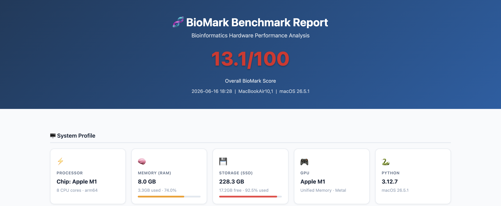
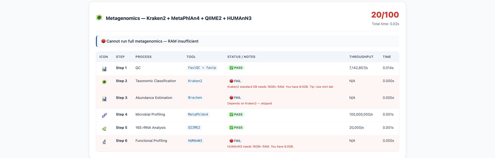

# BioMark 🧬

> **Open-source bioinformatics benchmark tool** — like Geekbench, but purpose-built for bioinformatics workloads.

[](https://opensource.org/licenses/MIT)
[](https://www.python.org/downloads/)
[](https://github.com/shahbazigenomics/BioMark/releases)
[]()
[](https://github.com/shahbazigenomics/BioMark/commits/main)
[](https://github.com/shahbazigenomics/BioMark/stargazers)
[]()

---

## 🎯 What is BioMark?

BioMark simulates real bioinformatics computational workloads **without requiring any tools to be installed**. It benchmarks your machine's CPU, RAM, and SSD performance specifically for bioinformatics pipelines — giving you an honest assessment of what your hardware can and cannot do.

**Designed for:**
- 🎓 Students choosing a laptop for bioinformatics
- 🔬 Researchers evaluating hardware upgrades
- 💻 Lab managers planning computing infrastructure
- 📊 Anyone comparing machines for genomics work

---

## 📸 Screenshots

### Overall Score + System Profile


### Score Overview


### WES Pipeline


### Bulk RNA-seq Pipeline


### scRNA-seq Pipeline


### Protein Structure


### Epigenomics


### Metagenomics


### Long Read Sequencing


### Genome Assembly


---

## 🚦 Project Status

**Current version: v0.5.0 (Active Development)**

BioMark is functional and actively developed. All 8 benchmark modules are working. The scoring system, HTML report, and hardware assessment are stable.

**What works now:**
- ✅ All 8 pipeline modules (DNA, RNA, scRNA, Protein, Epigenomics, Metagenomics, LongRead, Assembly)
- ✅ Automatic hardware detection (RAM, CPU, SSD, GPU)
- ✅ Honest PASS/FAIL scoring per pipeline step
- ✅ HTML report with charts and recommendations
- ✅ JSON export for programmatic use

**Roadmap:**
- 🔄 Community leaderboard website (biomark scores by machine)
- 🔄 Real dataset benchmarks (NA12878 WES reference sample)
- 🔄 Mac App Store release
- 🔄 Windows native support (currently via WSL2)
- 🔄 Tool paper submission

---

## 🖥️ Platform Support

| Platform | Status | Notes |
|---|---|---|
| **macOS** (Apple Silicon M1-M5) | ✅ Fully supported | Recommended — tested on M1 Air |
| **macOS** (Intel) | ✅ Supported | Not optimized for Intel GPU |
| **Linux** (Ubuntu, Debian, CentOS) | ✅ Fully supported | Ideal for HPC nodes |
| **Windows** (WSL2) | ⚠️ Supported via WSL2 | Run inside Ubuntu WSL2 terminal |
| **Windows** (native) | 🔄 Planned | Not yet supported natively |

---

## 🔬 Supported Pipelines

| Module | Flag | Tools Simulated | Key Bottleneck |
|---|---|---|---|
| 🧬 **DNA / WES** | `--dna` | BWA-MEM2, GATK, bcftools, FreeBayes, ANNOVAR | RAM (16GB+ for hg38) |
| 🔬 **Bulk RNA-seq** | `--rna` | STAR, HISAT2, DESeq2, edgeR, clusterProfiler | RAM (32GB for STAR) |
| 🔬 **scRNA-seq** | `--scrna` | Cell Ranger, Seurat, Scanpy, Monocle3 | RAM (32-64GB+) |
| 🔮 **Protein Structure** | `--protein` | AlphaFold2, ESMFold, BLAST, FoldX | RAM + GPU |
| 🧬 **Epigenomics** | `--epigenomics` | Bowtie2, MACS3, HOMER, DiffBind, chromVAR | RAM (16GB+) |
| 🦠 **Metagenomics** | `--metagenomics` | Kraken2, MetaPhlAn4, QIIME2, HUMAnN3 | RAM (16GB+) + SSD |
| 📡 **Long Read** | `--longread` | Dorado, Minimap2, Sniffles2, Medaka | RAM (16GB+) |
| 🔨 **Assembly** | `--assembly` | SPAdes, Flye, Hifiasm, QUAST, BUSCO | RAM (32-500GB+) |

---

## ⚡ Quick Start

### Requirements
- Python 3.8+
- 4GB RAM minimum (to run BioMark itself)
- Works on macOS, Linux, and Windows WSL2

### Installation

```bash
# Clone the repository
git clone https://github.com/shahbazigenomics/BioMark.git
cd BioMark

# Install dependencies
pip install -r requirements.txt
```

### Run Benchmarks

```bash
# Show your system hardware profile
python src/main.py --sysinfo

# Run a specific module
python src/main.py --dna          # DNA/WES pipeline
python src/main.py --rna          # Bulk RNA-seq
python src/main.py --scrna        # Single-cell RNA-seq
python src/main.py --protein      # Protein structure
python src/main.py --epigenomics  # ChIP-seq + ATAC-seq
python src/main.py --metagenomics # Metagenomics
python src/main.py --longread     # Nanopore + PacBio
python src/main.py --assembly     # Genome assembly

# Run ALL modules (full benchmark)
python src/main.py --all
```

---

## 📊 Example Output
╔══════════════════════════════════════════╗

║           BioMark v0.5.0  🧬             ║

║  Bioinformatics Benchmark Tool           ║

╚══════════════════════════════════════════╝
🖥️  System Profile

Machine  : MacBook Air M1

RAM      : 8GB Unified Memory

SSD Free : 17GB

CPU      : 8-core Apple M1
📊 BioMark Results

━━━━━━━━━━━━━━━━━━━━━━━━━━━━━━━━━━━━━━

Module          Score    Capability

━━━━━━━━━━━━━━━━━━━━━━━━━━━━━━━━━━━━━━

DNA/WES         15/100   🔴 RAM+SSD insufficient

RNA-seq         20/100   🔴 STAR needs 32GB RAM

scRNA-seq       10/100   🔴 Cell Ranger needs 32GB

Protein         15/100   🔴 AlphaFold needs 16GB

Epigenomics     10/100   🔴 Bowtie2 needs 16GB

Metagenomics    20/100   🔴 Kraken2 needs 16GB

Long Read       15/100   🔴 Minimap2 needs 16GB

Assembly         0/100   🔴 All assemblers fail

━━━━━━━━━━━━━━━━━━━━━━━━━━━━━━━━━━━━━━

⭐ OVERALL      13/100

━━━━━━━━━━━━━━━━━━━━━━━━━━━━━━━━━━━━━━

An HTML report is generated automatically with interactive charts,
per-step PASS/FAIL badges, hardware warnings, and time estimates.

---

## 🖥️ Hardware Requirements

| RAM | What You Can Run |
|---|---|
| 8GB | QC only (FastQC, MultiQC) |
| 16GB | WES single sample, RNA-seq with HISAT2 |
| 32GB | Full WES + RNA-seq with STAR |
| 36GB | WES + RNA-seq + scRNA-seq small datasets |
| 64GB | Full pipeline including medium scRNA-seq (30k cells) |
| 128GB+ | Large scRNA-seq (100k+ cells), genome assembly |

> 💡 **Large databases** (gnomAD ~1TB, Kraken2 ~100GB) can be stored
> on an external Thunderbolt SSD. BioMark detects this and gives
> specific recommendations automatically.

---

## 📁 Project Structure
BioMark/

├── src/

│   ├── main.py              # Main entry point + CLI

│   ├── system_info.py       # Hardware detection

│   ├── report.py            # HTML report generator

│   ├── utils.py             # Utilities + JSON encoder

│   └── modules/

│       ├── DNA/             # WES pipeline benchmark

│       ├── RNA/             # Bulk RNA-seq + scRNA-seq

│       ├── Protein/         # AlphaFold2 + ESMFold + BLAST

│       ├── Epigenomics/     # ChIP-seq + ATAC-seq

│       ├── Metagenomics/    # Kraken2 + MetaPhlAn4 + QIIME2

│       ├── LongRead/        # Nanopore + PacBio pipelines

│       └── Assembly/        # SPAdes + Flye + Hifiasm

├── results/                 # Benchmark results (JSON + HTML)

├── docs/

│   ├── CONTRIBUTING.md      # Contribution guidelines

│   └── INSTALLATION.md      # Detailed installation guide

├── requirements.txt

└── README.md

---

## 🏆 Share Your Score

Run BioMark on your machine and contribute to our community database!

```bash
python src/main.py --all --share
```

This generates a clean `biomark_share_TIMESTAMP.json` file with your hardware specs and scores.

**To submit:**
1. Open a GitHub Issue: [Submit My Score](https://github.com/shahbazigenomics/BioMark/issues/new)
2. Title: `Score Submission — [Your Machine] [RAM]GB`
   - Example: `Score Submission — MacBook Pro M5 Pro 36GB`
3. Attach your `biomark_share_*.json` file

Your data helps researchers choose the right hardware for bioinformatics! 🧬

---

## 🤝 Contributing

We welcome contributions from the bioinformatics community!

### How to contribute

1. **Fork** the repository
2. **Create a branch** for your feature: `git checkout -b feature/new-module`
3. **Make your changes** following the existing module structure
4. **Test** your changes: `python src/main.py --your_module`
5. **Submit a Pull Request** with a clear description

### What we need help with
- 🆕 New pipeline modules (spatial transcriptomics, variant phasing)
- 🐛 Bug reports — please open a [GitHub Issue](https://github.com/shahbazigenomics/BioMark/issues)
- 📊 Benchmark results from different machines (help us build the database!)
- 🌍 Testing on different operating systems and hardware

### Coding guidelines
- Follow the existing module structure in `src/modules/`
- Each step must return a `status` field with `✅ PASS` or `🔴 FAIL`
- Include honest hardware checks with RAM/SSD thresholds
- Add your module to `src/main.py` and `src/report.py`

See [CONTRIBUTING.md](docs/CONTRIBUTING.md) for detailed guidelines.

---

## 📖 How to Cite

BioMark does not yet have a peer-reviewed publication.
If you use BioMark in your work, please cite it as:
Shahbazi, A. BioMark: An open-source bioinformatics benchmark tool

for hardware evaluation (v0.5.0). GitHub (2026).

https://github.com/shahbazigenomics/BioMark

> 📌 A Zenodo DOI for formal citation will be added in a future release.
> A tool paper is planned for submission to *Bioinformatics* or *GigaScience*.

---

## 👨‍🔬 Author

**Amir Shahbazi**
PhD Candidate in Genomics
Specialization: Whole Exome Sequencing & Rare Variant Analysis in Familial Cases

[](https://github.com/shahbazigenomics)

---

## 📄 License

This project is licensed under the MIT License.
See [LICENSE](LICENSE) for details.

---

⭐ **If BioMark helps your research or hardware decisions, please give it a star!**
It helps other researchers and students discover this tool.

---

*BioMark simulates bioinformatics workloads for hardware benchmarking.*
*It does not replace actual pipeline validation on real datasets.*
